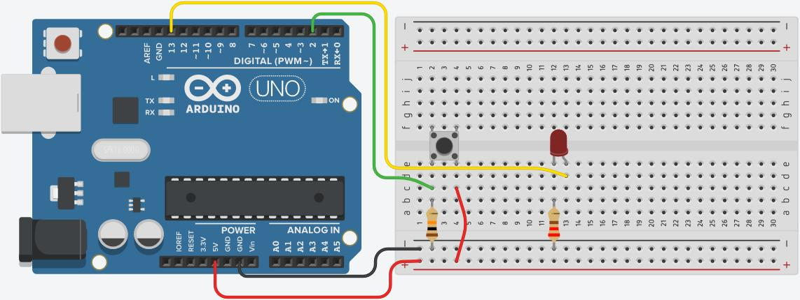

# Introduksjon {.intro}

*Hvor nøyaktig er klokken i hjenen din?*

Nå skal vi lage et spill der det om å gjøre å telle sekunder så nøye som mulig.

Spillet skal fungere slik:

1. Et lys blinker fem ganger med ett sekunds mellomrom (én…to…tre…fire…fem)

2. Så skal du telle sekunder selv: seks…sju…åtte…ni…**ti** – og så skal du
   trykke på knappen når det har gått nøyaktig 10 sekunder

3. Du får poeng etter hvor nøyaktig du traff – hvis du trykker nøyaktig 10
   sekunder etter det første blinket så får du over 9000 poeng!

Vi starter med å sende poengsummen til PC-en via USB-kabelen, men til slutt så
kan vi vise den på et 7-segments display i stedet.


# Steg 1: Finn frem utstyr {.activity}

## Til denne oppgaven trenger du {.check}

- [ ] 1 Arduino

- [ ] 1 lysdiode

- [ ] 1 koblingsbrett

- [ ] 1 trykknapp

- [ ] 1 motstand på 220 Ohm (fargekode rød-rød-svart-gull)

- [ ] 1 motstand på 10k Ohm (fargekode brun-svart-orange-gull)

- [ ] Ledninger



## Test prosjektet {.flag}

__Klikk på det grønne flagget.__ / __Start prosjektet for å teste koden så
langt.__

- [ ] Du skal se at...

- [ ] Prøv å endre tallene i koden din. Kan du få til at...

- [ ] Forstår du hvorfor dette skjer?

## Sjekkliste {.check}

- [ ]

## Test prosjektet {.flag}

__Klikk på det grønne flagget.__ / __Start prosjektet for å teste koden så
langt.__

- [ ]


# Steg 2: Andre steg {.activity}


I dette steget skal vi...

## Sjekkliste {.check}

- [ ]

- [ ]

  Du kan sette inn en kodeblokk ved å bruke ``` før og etter koden.

- [ ]

## Test prosjektet {.flag}

__Klikk på det grønne flagget.__ / __Start prosjektet for å teste koden så
langt.__

- [ ] Du skal se at...

- [ ] Prøv å endre tallene i koden din. Kan du få til at...

- [ ] Forstår du hvorfor dette skjer?

## Utfordring {.challenge}

Du kan prøve...

## Tips {.tip}

Et tips for å løse utfordringen er...

## Lagre spillet {.save}

Vi har laget...

Husk å lagre spillet/programmet ditt. Når du er ferdig kan du klikke på `Legg
ut`-knappen. Da vil det bli lagt ut på Scratch-hjemmesiden din slik at du enkelt
kan dele det med familien og vennene dine.
